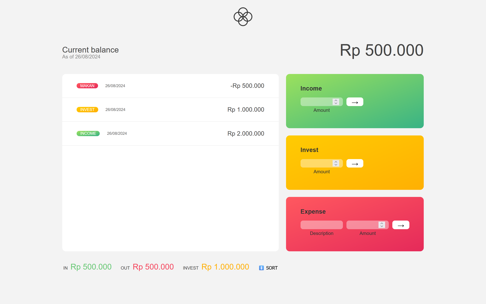

# Bankist Tracker 💰

Welcome to **Bankist Tracker**, a modern transaction tracking app that helps you manage your finances with ease. This application allows you to record and monitor your income, expenses, and investments, providing a clear overview of your financial health. It's built using [React TS](https://reactjs.org/) with [Vite](https://vitejs.dev/) for fast and efficient development, and is hosted on [Vercel](https://vercel.com/).

<br>

## 🚀 Live Demo

Check out the live version of the app:
[https://bankist-kez.vercel.app/](https://bankist-kez.vercel.app/).

## 🛠️ Features

- **Transaction Management**: Record and categorize your income, expenses, and investments with ease.
- **Real-Time Balance Update**: Instantly see your updated balance as you add transactions.
- **Delete Transactions**: Easily remove any transaction you no longer want to track.
- **Browser Local Storage**: All transactions are stored locally in your browser, ensuring your data persists even after you close the app.
- **Sort By Date and Amount Options**: Organize your transaction history to easily track your financial activity.

## 💻 Technologies Used

- **Frontend**: React.js (TypeScript), CSS
- **Tooling**: Vite, ESLint
- **Hosting**: Vercel

## 📸 Screenshots



## 🔧 Installation

If you want to run this project locally, follow these steps:

1. Clone the repository:
   ```bash
   git clone https://github.com/Kezota/Bankist.git
   ```
2. Navigate to the project directory:
   ```bash
   cd Bankist
   ```
3. Install the dependencies:
   ```bash
   npm install
   ```
4. Start the development server:
   ```bash
   npm run dev
   ```
5. Open `http://localhost:5173` in your browser to view the app.

## 👏 Credits

This project was built using templates and designs provided by [Jonas Schmedtmann](https://github.com/jonasschmedtmann)

## 🤝 Contributing

If you'd like to contribute to the development of this project, feel free to fork the repository and submit a pull request. Contributions are always welcome!
